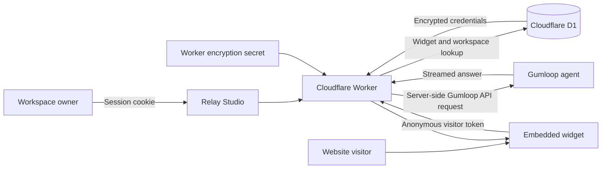

# Relay architecture

Relay turns an existing Gumloop agent into an embeddable website chat. Gumloop runs the agent. Relay provides the widget editor, installation script, and server routes that connect visitors to the selected agent.

## Connecting an account

A visitor creates a private workspace by entering a name, a Gumloop API key, and a Gumloop user ID. Relay validates the credentials with Gumloop before creating the workspace. No Gumloop password is requested.

Relay returns a randomly generated workspace access code once. This is the workspace's login credential. Save it in a password manager: there is no email-based account recovery. The code is not the Gumloop API key. Relay stores only its cryptographic hash and uses an HttpOnly session cookie after login.

Signing out and opening another workspace changes the editor's account. Existing website widgets remain attached to the workspace that published them.

## Request flow

The browser receives widget appearance settings and a visitor-specific chat token. It never receives the workspace's Gumloop key. A public widget identifier selects a saved widget; the backend determines which workspace and agent it belongs to. A visitor cannot supply an arbitrary Gumloop agent or upstream conversation ID.

## Credential storage

- API keys are encrypted with AES-256-GCM before being stored in D1. Each encryption uses a fresh random nonce.
- The authenticated encryption context includes the workspace ID. Moving an encrypted credential record to another workspace does not make it decryptable there.
- The encryption key is held separately as a Cloudflare Worker secret. It is not part of the database, frontend bundle, or Git repository.
- Saved credentials are decrypted only in server memory for Gumloop requests. Connection responses do not return API keys, and application logs exclude credential bodies.
- Once connected, a workspace stays bound to the same Gumloop account. Credential replacement accepts a new key for that account. A different account gets a separate workspace.
- Disconnect removes the stored credential, unpublishes the workspace's widgets, and invalidates its visitor and preview contexts. Draft designs remain. Already-started Gumloop work may continue, and disconnect does not revoke the API key in Gumloop itself.

Encryption protects database contents; the running backend must be able to decrypt credentials. This is not end-to-end encryption, and an operator with deployment/secret access must be trusted. Keep Cloudflare account access restricted and rotate secrets when necessary. Database backups can retain older encrypted records according to the hosting platform's retention policy.

## Isolation and public access

Every authenticated dashboard request resolves the workspace from the server-side session. Widget reads, edits, previews, publishing, credential access, and rate limits are scoped to that workspace. The legacy owner's deployment credentials are never used as a fallback for a guest workspace.

Public conversations have separate anonymous visitor ownership. Exact allowed website origins restrict browser embedding; they do not prove a visitor's real-world identity. Session locks and per-workspace concurrency limits prevent overlapping requests from bypassing the configured limits.

A public widget runs the selected agent with the connected Gumloop account's permissions. Use an agent intended for anonymous visitors. Relay's conversation isolation cannot prevent an agent's own tools or knowledge from exposing information the agent is allowed to access. Sensitive customer-specific actions require their own authorization.

## Demonstrating it

1. Open Relay in a private browser window to show the new-workspace screen.
2. Enter credentials off camera, create the workspace, and save the access code privately.
3. Show that the dashboard contains the connected account's agents and its own widgets.
4. Customize a widget and ask the real agent a question in the preview.
5. Add a website origin, publish, and copy the credential-free script tag.
6. Show Connection settings and explain that the credential can be replaced or disconnected.

A concise explanation for a demo video:

> You can connect your own Gumloop account and turn one of your agents into a website widget. The browser talks to a Cloudflare Worker, which stores the key encrypted and calls Gumloop on your behalf. Each workspace has separate credentials and widgets. The embed contains a widget ID, never your API key.

## OAuth

This version uses user-provided API credentials. Gumloop documents an OAuth flow, but app registration is invite-only. OAuth can replace the credential-entry step later without changing the editor or embed model. See [Gumloop OAuth documentation](https://docs.gumloop.com/api-reference/oauth).
